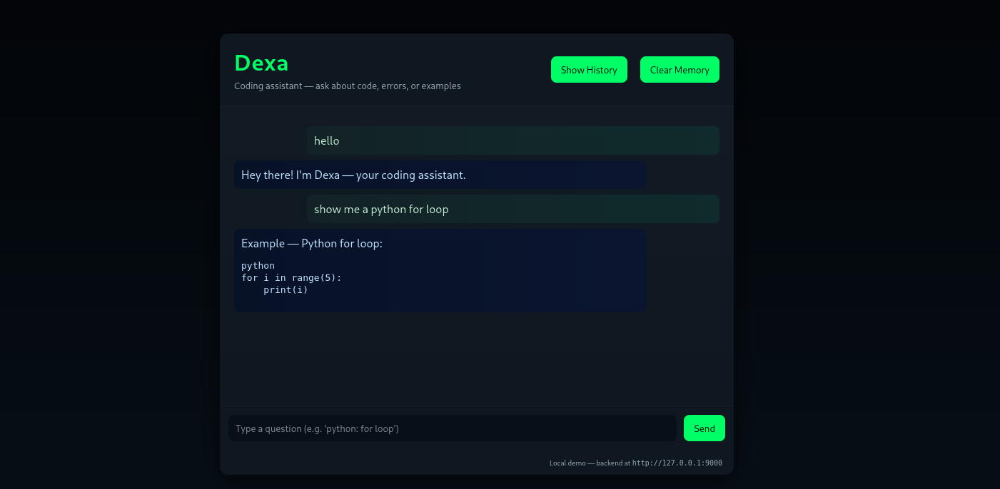

# 🤖 Dexa — Your Local AI Coding Assistant

Dexa is a lightweight **FastAPI + JavaScript** chatbot that runs fully **offline**.  
It helps you generate code snippets, debug simple logic, and chat about programming — all locally.

---

## 🖼 Demo



---

## 🚀 Features
- 🧩 **FastAPI Backend** – Handles `/chat` requests with memory-based responses  
- 💬 **Interactive Frontend** – Clean HTML/CSS/JS chat UI  
- 🔒 **Fully Local** – No external API calls, no data leaks  
- ⚡ **Instant Response** – Lightweight and fast on any system  

---

## ⚙️ Installation

```bash
# Clone the repository
git clone https://github.com/<your-username>/Dexa.git
cd Dexa

# (Optional) Create virtual environment
python3 -m venv venv
source venv/bin/activate

# Install dependencies
pip install -r requirements.txt
